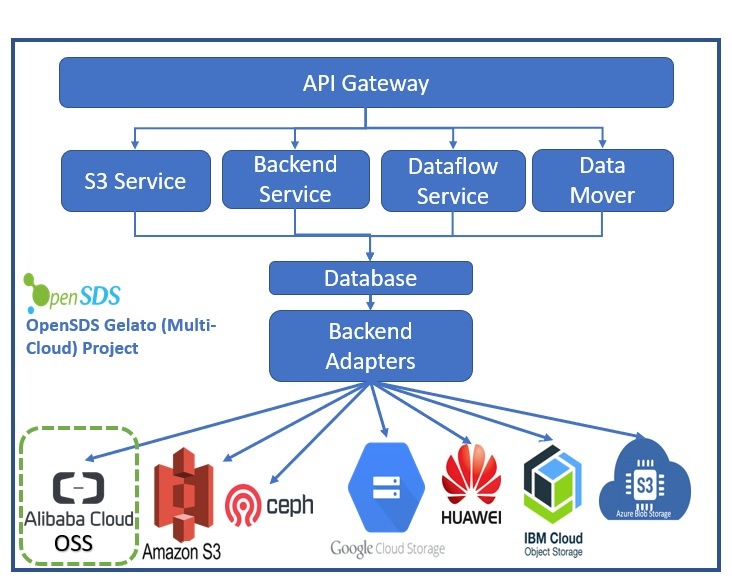

# Integration of Alibaba Cloud in OpenSDS/Multi-cloud
**Author(s)**:  [Click2Cloud Technology Services India Pvt. Ltd.](https://www.click2cloud.com/)
### Introduction
Currently there is no object management mechanism for Alibaba Cloud in multi-cloud.By adding support of Alibaba OSS service will provide object management mechanism for Alibaba Cloud.

### Goals

1. Add support of Alibaba OSS service in OpenSDS Gelato Project.

2. User can upload, download, delete data from OpenSDS bucket.

3. User can easily migrate object from one OpenSDS bucket of Alibaba to another OpenSDS bucket smoothly.

4. User can make a rule for Lifecycle Management for OpenSDS Bucket of Alibaba for cost optimization.

### Architecture Diagram

                    Figure: Architure of Integration of Alibaba Cloud in OpenSDS

Alibaba OSS is added as a Backend Adapters.
